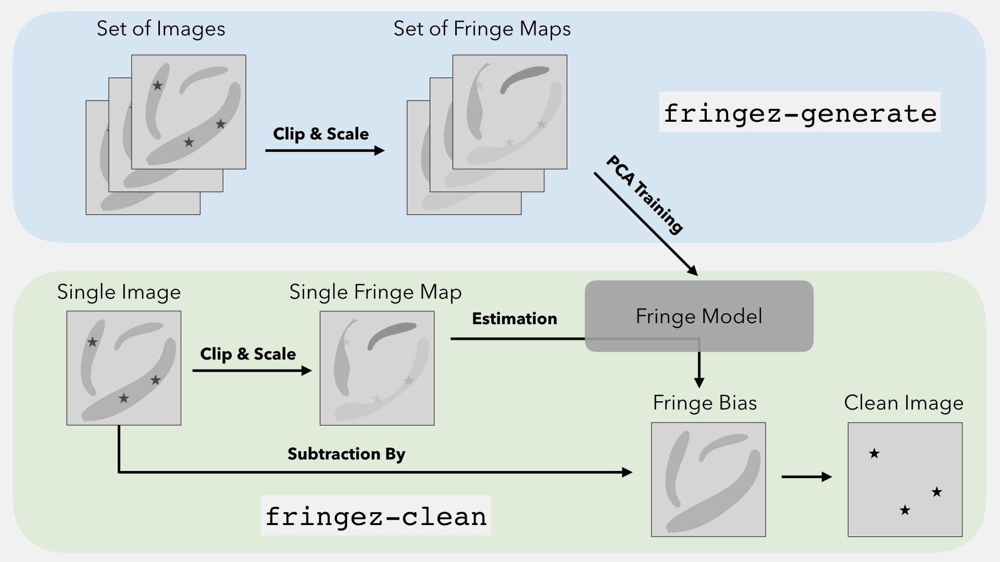

# fringez

## Getting Started

ZTF i-band images are contaminated with atmospheric fringes that significantly 
effect the photometric solution of sources within the image. ```fringez``` uses 
principal component analysis to generate a fringe model from these i-band 
images. Each ZTF readout channel generates similar atmospheric fringe patterns 
and therefore requires its own fringe model. That fringe model can then be 
used to generate a fringe bias image for each contaminated i-band image which, 
when subtraction from the i-band image, removes the atmospheric fringes. 
This results in a clean i-band image.  

**Diagram of fringez Schema**


```fringez``` installs three executables.

- ```fringez-download```: Downloads pre-generated fringe models from the NERSC 
web portal
- ```fringez-clean```: Cleans contaminated i-band images using fringe models
- ```fringez-generate```: Generates new fringe models using contaminated i-band 
images

### Installation

Preferred method is through pip:

```
pip install fringez
```

Latest version can also be installed from github:
```
git clone https://github.com/MichaelMedford/fringez.git
cd fringez
python setup.py install
```

### Downloading Fringe Models
Users must have fringe models on disk in order to clean i-band images with 
atmospheric fringes. These fringe models are what generate a fringe bias 
image for each contaminated i-band image which, when subtraction from the 
i-band image, removes the atmospheric fringes. This results in a clean i-band 
image.  

To download fringe models for all 64 ZTF readout channels, execute the 
```fringez-download``` executable.

This script will download pre-generated fringe models that are stored on 
a NERSC web portal.  You will be asked to input a ```MODEL_DATE``` 
which signifies the version of the saved models. Models will be downloaded to 
disk in the user's current directory and extracted from a tar.gz file. Models 
(```*.model```) and the lists of files that created them (```*.model_lists```) 
will end up in a folder named ```MODEL_DATE```.

Current model versions (and size after extraction):
* 20190618 (16 GB)

### Generating Clean Images
Contaminated images can be cleaned with the ```fringez-clean``` executable.

Contaminated images can either be cleaned one at a time with the 
```-single-image``` argument, or all images in a folder can be cleaned with the 
```-all-images-in-folder``` argument. All clean images will have the same 
filename as the science images, but with the extension ```sciimg.clean.fits```. 
To save the fringe bias images to disk for debugging, select the ```-debug``` 
argument.

#### Cleaning all contaminated images in a folder

Cleaning a folder of contaminated images requires specifying the folder where 
fringe models are located. ```fringez-clean``` will automatically pair the 
correct fringe model with each contaminated image.

From within the directory where all of the science images are located, 
execute ```fringez-clean -all-images-in-folder 
-fringe-model-folder={FRINGE_MODEL_FOLDER}```. The ```-fringe-model-folder``` 
argument must be set when ```-all-images-in-folder``` is selected.

When cleaning all images, ```fringez-clean``` can either clean one image at a 
time with the ```-serial``` argument, or clean images in parallel with the 
```-parallel``` argument. Images are cleaned in ```-serial``` by default. 
Parallelization is executed with the mpi4py package and simply splits the list 
of images in the folder across the processes used to launch the 
```fringez-clean``` executable.

#### Cleaning a single contaminated image

Cleaning a single contaminated image requires specifying a fringe model. This 
fringe model should match the readout channel ID of the contaminated image. 
The image and the model will both be labelled with the same quadrant ID and 
ccd ID. For example, if ```ztf_20190703184838_000481_zi_c02_o_q1_sciimg.fits```
is the contaminated image, then 
```fringe_PCArandom_comp06.c02_q1.20190618.model``` would be the correct model 
because of the matching ``c02`` and ```q1``` parameters. 

From within the directory where the contaminated science image is located, 
execute ```fringez-clean -single-image -image-name={IMAGE_NAME} 
-fringe-model-name={FRINGE_MODEL_NAME}```. The ```-image-name``` and 
```-fringe-model-name``` arguments must be set when ```-single-image``` is 
selected.  

### Generating Fringe Models
*Note: Downloading pre-generated models using the fringez-download executable 
is recommended. Most users will not need to generate new fringe models*

Fringe models are generated with the ```fringez-generate``` executable.

The models which will be generated are listed in 
```$PATH_TO_FRINGEZ_DIR/model.py:return_estimators```. 
The number of components in each model fit are set with the 
```--n-components``` argument. Plots of the eigenimages can be generated for 
debugging with the ```--plots``` argument.
 
To generate fringe models:

1) Place images containing fringes into a directory. **All images within the 
directory must have the same RCID. Models are made separately for each ZTF 
RCID.** Image names are expected to begin with **ztf** and end with 
```sciimg.fits```. 
2) From within this folder, execute ```python 
$PATH_TO_FRINGEZ_DIR/generate_fringe_model.py```. By default the script will 
choose six components and will not generate debugging plots. 
3) The current directory will now contain a model or models of the fringes, 
named **fringe\_{MODEL_NAME}\_comp{N_COMPONENTS}.c{CID}\_q{QID}.{DATE}.model**. 
By default the script will only generate **PCArandom** models, but more models 
can be tested by editing the ```return_estimators``` function in 
```model.py```. The current directory will also contain a ```*.model_list``` 
file for each model listing the images that went into the creation of the 
model.

## Requirements
* Python 3

## Authors

* Michael Medford <MichaelMedford@berkeley.edu>
* Peter Nugent <penugent@lbl.gov>
